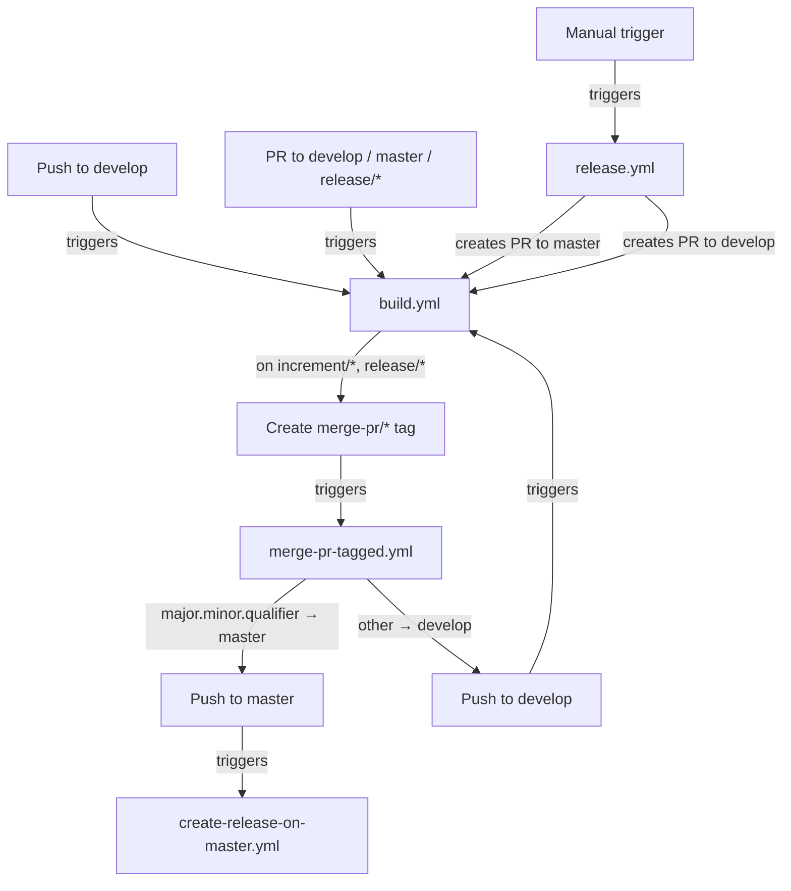
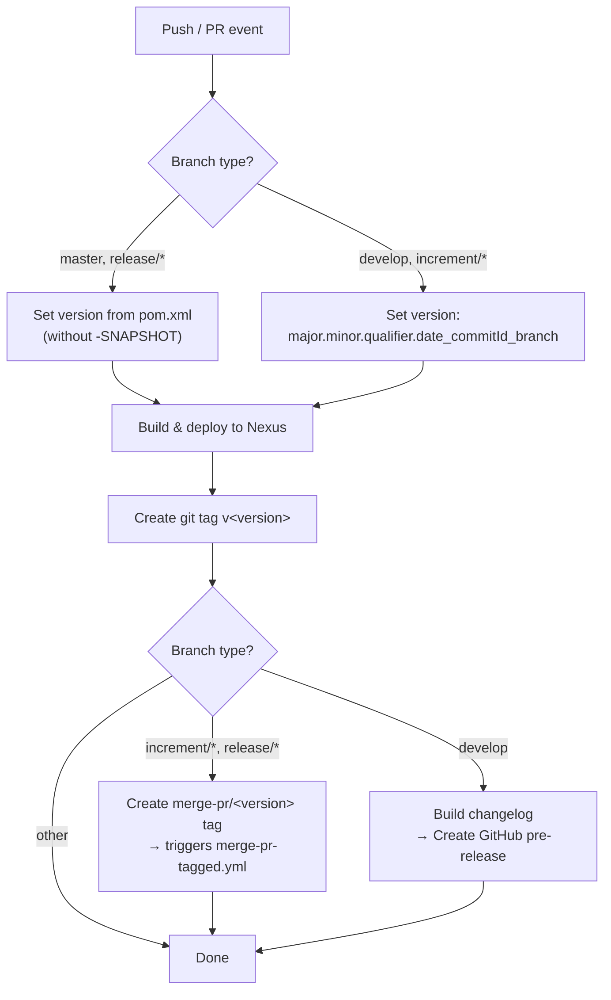
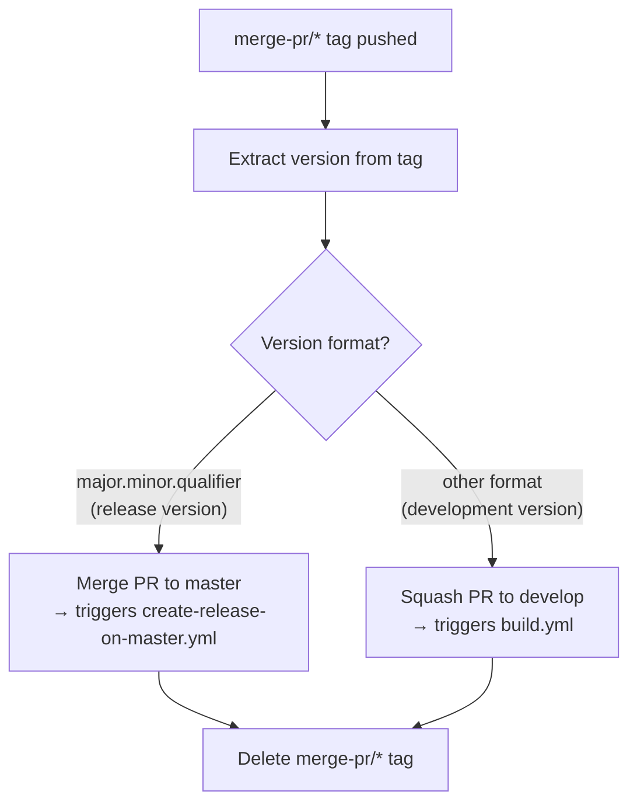
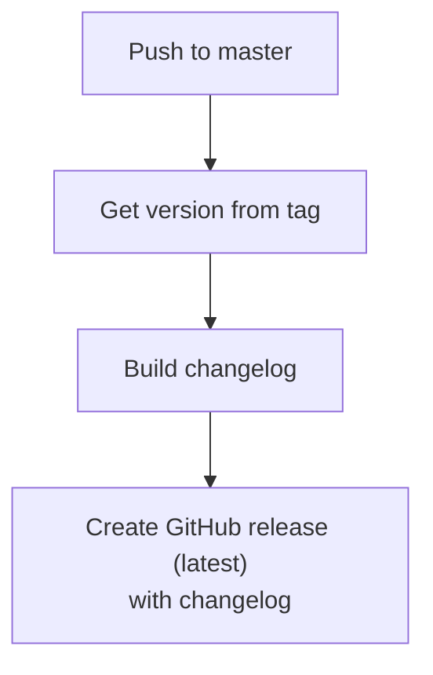
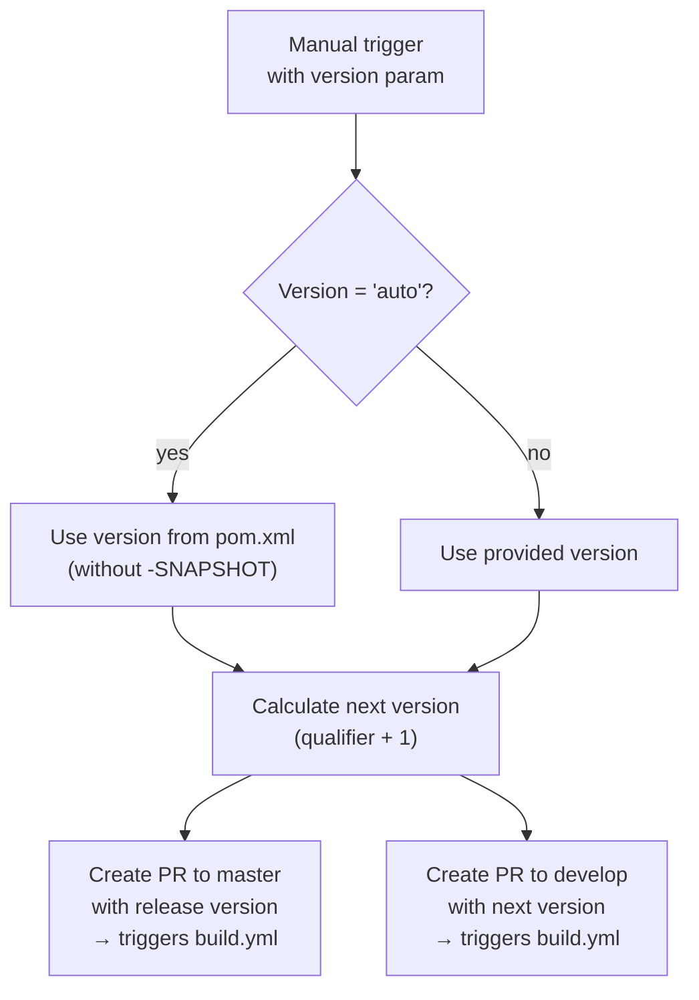
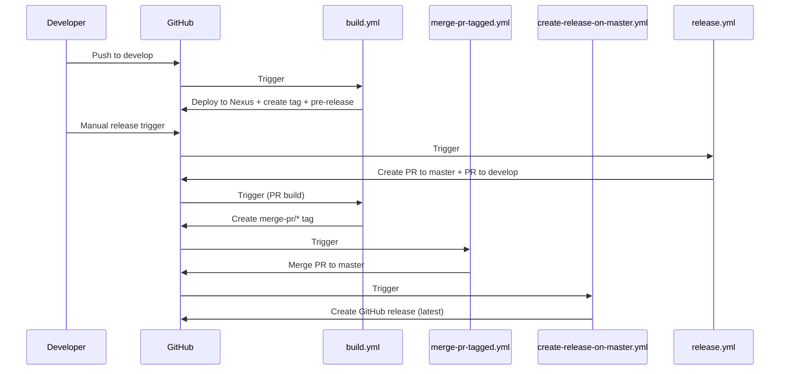

# CI/CD Flow

This document describes the GitHub Actions workflows that automate building, testing, releasing, and merging for the OSGi FileStore project.

## Workflow Overview

## build.yml — Main CI/CD Pipeline

Triggered on pushes to `develop` and pull requests targeting `develop`, `master`, `increment/*`, or `release/*` branches.

### Version Formats

| Branch | Version Format | Example |
|--------|---------------|---------|
| `master`, `release/*` | `major.minor.qualifier` | `1.3.0` |
| `develop`, `increment/*` | `major.minor.qualifier.YYYYMMDD_HHMMSS_commitId_branch` | `1.3.1.20260226_143000_abc1234_develop` |

## merge-pr-tagged.yml — Automatic PR Merging

Triggered when a `merge-pr/*` tag is pushed (by build.yml).

## create-release-on-master.yml — Production Release

Triggered when commits land on `master` (typically via merge from a release PR).

## release.yml — Manual Release Trigger

Manually triggered with a version parameter. Creates the release and increment PRs that flow through the rest of the pipeline.

## Complete Pipeline Interaction

