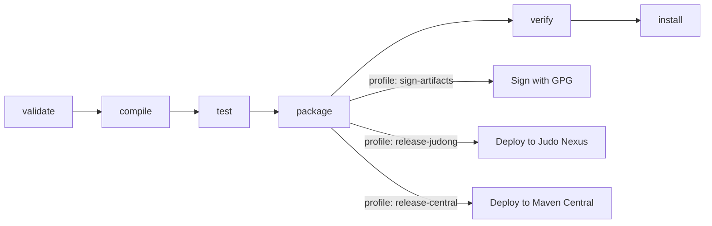
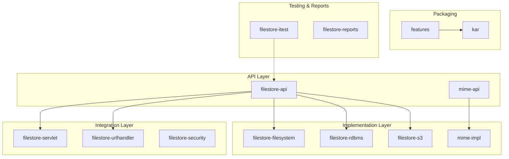
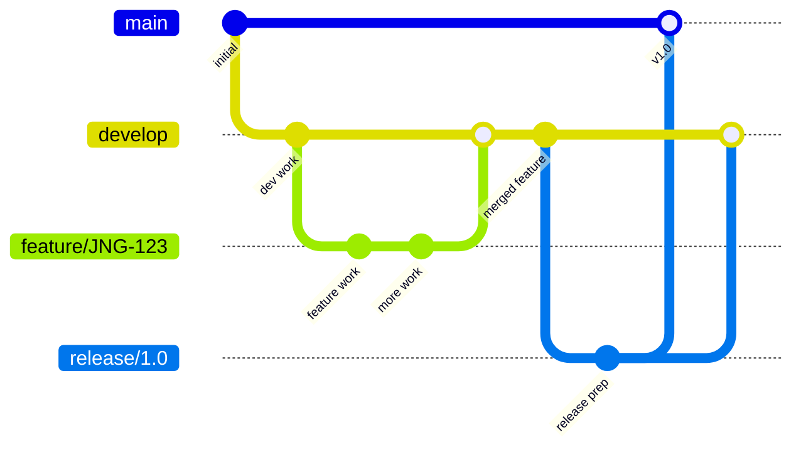

# Contributing to OSGi FileStore

## Development Environment

### Required Tools

| Tool | Version | Notes |
|------|---------|-------|
| **JDK** | 21+ | [Azul Zulu](https://www.azul.com/downloads/?version=java-21-lts&package=jdk) recommended |
| **Maven** | 3.8.x+ | Wrapper available via `./mvnw` |
| **Git** | Any recent | GitFlow branching model |

### Verify Your Setup

```sh
# Java — should show version 21+
java -version

# Maven — should show 3.8.x+
mvn -version
```

## Build Commands

```sh
# Run all unit tests
mvn clean test

# Full build (compile + test + package + install to local repo)
mvn clean install

# Build a single module
mvn clean test -pl filestore-rdbms

# Run a single test class
mvn clean test -pl filestore-rdbms -Dtest=RdbmsFilestoreTest

# Skip integration tests (Pax Exam / Karaf — slow)
mvn clean install -pl '!filestore-itest'
```

## Build Lifecycle



### Maven Profiles

| Profile | Purpose |
|---------|---------|
| `modules` | Selects which modules to build (active by default) |
| `sign-artifacts` | GPG-signs artifacts for release |
| `release-dummy` | Deploys to `/tmp` for testing |
| `release-judong` | Deploys to Judo Nexus repository |
| `release-central` | Deploys to Maven Central (OSS Sonatype) |
| `generate-github-asciidoc-diagrams` | Generates PlantUML/Ditaa diagrams |
| `update-source-code-license` | Updates Apache 2.0 license headers |

## Code Structure

This project is a multi-module Maven build producing OSGi bundles for Apache Karaf. Each module uses the Felix Maven Bundle Plugin to generate OSGi manifests.



> **Note:** Integration tests (`filestore-itest`) boot a real Karaf container using Pax Exam. They are significantly slower than unit tests and require the full project to be installed first (`mvn clean install`).

## Submission Guidelines

### Issue Tracking

We use [JIRA](https://blackbelt.atlassian.net/jira/dashboards) for issue tracking.

> **Important:** There is no commit without a ticket number. Every commit and pull request must reference a JIRA ticket in the format `JNG-xxx`.

When reporting a bug, include:
- Output of `java -version` and `mvn -version`
- Relevant `pom.xml` or `.flattened-pom.xml`
- A minimal reproducible use case

You can also file issues via the [GitHub issue form](https://github.com/BlackBeltTechnology/osgi-filestore/issues/new/choose).

### Pull Requests

This project follows [GitHub's standard forking model](https://guides.github.com/activities/forking/). Fork the repository and submit pull requests from your fork.

See [CI Flow](.github/CIFLOW.md) for details on how the CI/CD pipeline processes pull requests.

## Git Workflow & Branching

The project uses a GitFlow-based branching model:



| Branch Pattern | Base | Purpose |
|---------------|------|---------|
| `develop` | — | Main development branch, latest sources |
| `feature/JNG-xxx_summary` | `develop` | New features for the active version |
| `release/x.y.z` | `develop` | Release stabilization |
| `bugfix/JNG-xxx_summary` | release branch | Bug fixes during release testing |
| `support/JNG-xxx_summary` | release branch | Minor changes for previous releases |
| `hotfix/JNG-xxx_summary` | `master` | Emergency fixes for production |
| `master` | — | Latest released production sources |

### Version Number Rules

- **Feature branches**: Do not change version numbers
- **Release branches**: 2nd number incremented on `develop` when release branch starts
- **Bugfix branches**: Do not change version numbers (applied during release testing)
- **Support branches**: 3rd number incremented when started
- **Hotfix branches**: 4th number incremented when started
