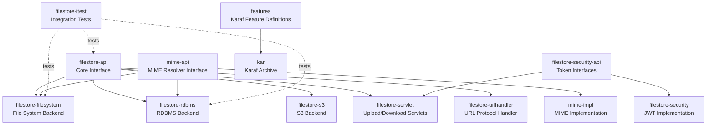
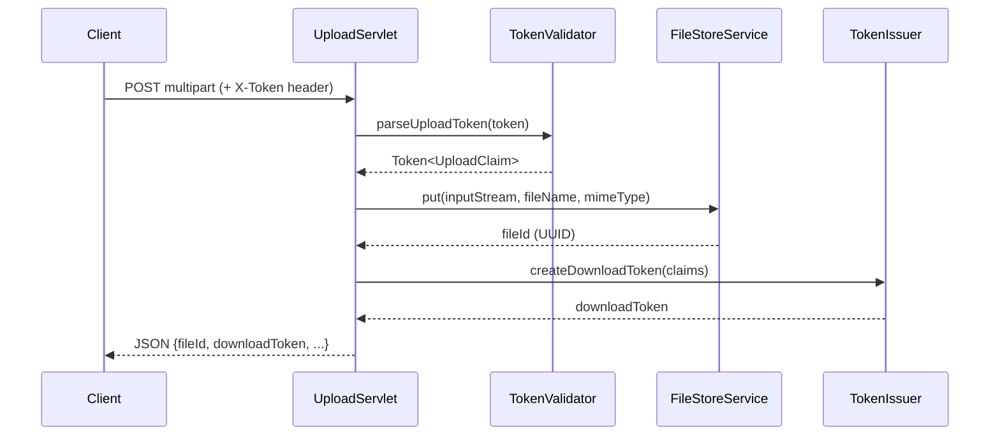
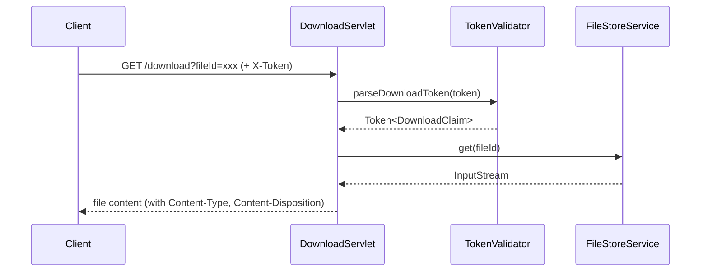
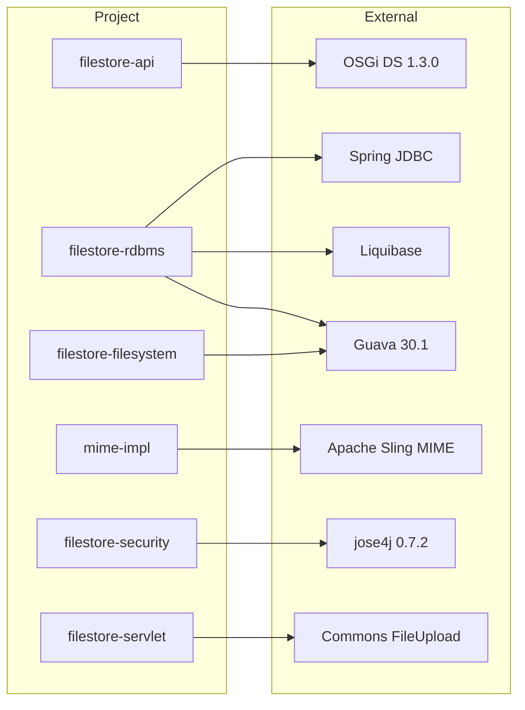

# OSGi FileStore

[](https://github.com/BlackBeltTechnology/osgi-filestore/actions/workflows/build.yml)

## Introduction

OSGi FileStore is a blob-based file storage service that provides a unified API for storing and retrieving files across multiple backends — RDBMS, filesystem, and S3. It runs inside an Apache Karaf OSGi container and includes HTTP servlets for upload/download, JWT-based security, and custom URL protocol handling.

The project is designed as a set of loosely coupled OSGi bundles, so you can deploy only the storage backend and features you need.

## Module Overview



## Core API

The central interface is `FileStoreService`, which all storage backends implement:

```java
public interface FileStoreService {
    String put(InputStream data, String fileName, String mimeType) throws IOException;
    boolean exists(String fileId);
    InputStream get(String fileId) throws IOException;
    String getMimeType(String fileId) throws IOException;
    String getFileName(String fileId) throws IOException;
    long getSize(String fileId) throws IOException;
    Date getCreateTime(String fileId) throws IOException;
    URL getAccessUrl(String fileId) throws IOException;
    String getProtocol();
}
```

Files are identified by UUID-based string IDs returned from `put()`.

## Storage Backends

### RDBMS (`filestore-rdbms`)

Stores files in a database table (default: `FILESTORE`) using Spring JDBC. Schema is managed by Liquibase. Metadata is cached with Guava LoadingCache (10k entries, 10-minute TTL).

| Column | Type | Description |
|--------|------|-------------|
| `FILE_ID` | VARCHAR(255), PK | UUID identifier |
| `FILENAME` | VARCHAR(255) | Original filename |
| `DATA` | LONGBLOB | File content |
| `SIZE` | BIGINT | File size in bytes |
| `MIME_TYPE` | VARCHAR(255) | Content type |
| `CREATE_TIME` | TIMESTAMP | Creation time |

### Filesystem (`filestore-filesystem`)

Stores files on disk in a nested 2-character directory structure derived from the UUID. Each file has a companion `file.properties` sidecar for metadata. Default root: `~/file-store`.

### S3 (`filestore-s3`)

Cloud storage backend using Amazon S3.

## Servlet Layer

Two HTTP servlets handle file transfer over HTTP:

- **UploadServlet** — receives multipart uploads, validates MIME types against upload tokens, returns JSON with file metadata and download tokens
- **DownloadServlet** — serves files with proper Content-Type and Content-Disposition headers, supports token-based access control

Both servlets include CORS support and configurable size limits.

## Security

JWT-based security using jose4j. The `TokenIssuer` creates upload/download tokens with claims (allowed MIME types, max file size, file ID, etc.), and `TokenValidator` verifies them. Token enforcement is optional per-servlet.

## Runtime Flow





## Dependency Graph



## Contributing

See [CONTRIBUTING.md](CONTRIBUTING.md) for development setup, submission guidelines, and CI/CD workflow details.

## License

This project is licensed under the [Apache License 2.0](https://www.apache.org/licenses/LICENSE-2.0).
